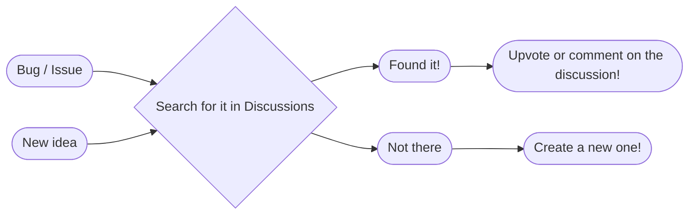

# Welcome to the Shaker Contribution Guidelines
Make sure you follow the Code of Conduct where applicable, and remember that at the end of the day, we're all humans. Well, mostly.

## Feedback
Your voice matters! If you have any feedback, this chart should help you to find the best way of expressing it.
Usually, that way is through [Discussions](https://github.com/Gabriel-H4/Shaker/discussions).

If you have an idea or find a bug, it will be converted into an issue where you can track its status. Using discussions allows for you to leave more details!
